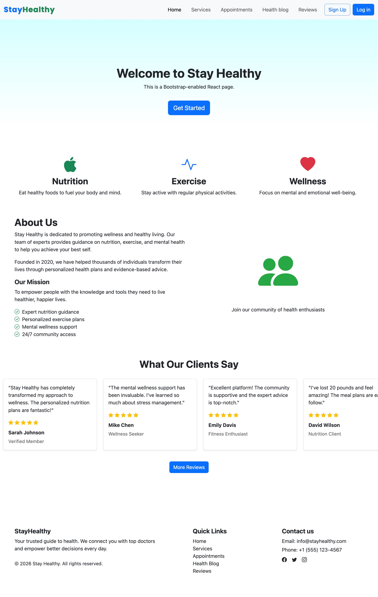

# StayHealthy — React Web App

<p align="center"></p>

A full-featured health & wellness platform built with **React 18 + Vite**, allowing patients to book doctor appointments, start instant consultations, run guided self check-ups, read health articles, and manage their reviews and reports — all in a single-page application.

---

## 📘 Project

This project is a submission for the IBM Front-End Developer course. It shows beginner to intermediate level practical skills in frontend development, including React, state management, routing, and user flows. 

More advanced techniques will be implemented in future updates. 

### 🏅 Certifications

- **IBM Front-End Development Capstone Project**  
  https://www.credly.com/badges/348902cd-4e26-4e60-bbd1-01446e96c84c  

- **IBM Front-End Developer Professional Certificate**  
  https://www.credly.com/badges/4f1eb052-2671-4381-9898-da620b9bb036  


---

## Tech Stack

| Layer | Technology |
|---|---|
| UI Framework | React 18 |
| Language | JavaScript (ES6+, JSX) |
| Build Tool | Vite |
| State Management | Redux Toolkit |
| Routing | React Router v6 |
| Styling | Bootstrap 5 + Bootstrap Icons |
| PDF Generation | jsPDF |
| Language | JavaScript (JSX) |

---

## 📁 Project Structure

```
src/
├── App.jsx                   # Root router — all routes defined here
├── main.jsx                  # React entry point
├── styles.css                # Global styles, custom theme, skip-link
│
├── assets/                   # Static images
├── data/
│   └── doctors.js            # Mock doctor data (name, specialty, rating, etc.)
│
├── hooks/
│   └── usePageTitle.js       # Sets document.title + meta description per page
│
├── store/
│   ├── store.js              # Redux store (auth + bookings reducers)
│   ├── authSlice.js          # Auth state: login / logout
│   └── bookingsSlice.js      # Appointments, consultations, reviews state
│
├── components/
│   ├── AppLayout.jsx         # Root layout: skip link, Navbar, <main>, Footer
│   ├── Navbar.jsx            # Responsive navbar with auth-aware user menu
│   ├── Footer.jsx            # Site footer with quick links + contact
│   ├── Popup.jsx             # Reusable accessible modal (role=dialog, Escape key)
│   ├── DoctorCard.jsx        # Doctor info card with Book / Consult actions
│   ├── DoctorSearch.jsx      # Search + specialty filter for doctor listings
│   ├── AppointmentForm.jsx   # Appointment booking form (date/time picker)
│   ├── AppointmentFormIC.jsx # Instant consultation booking form
│   ├── ConsultationForm.jsx  # Consultation slot selector
│   ├── BookingList.jsx       # List of booked appointments or consultations
│   ├── BookingsTable.jsx     # Tabular view of bookings with actions
│   ├── BookingsWidget.jsx    # Floating Action Button showing booking count
│   ├── CancelBookingPopup.jsx# Confirm-cancel popup for bookings
│   ├── GiveReviews.jsx       # ReviewForm (public) + ReviewPopup (per-booking)
│   ├── ReviewCard.jsx        # Displays a single review with star rating
│   ├── HomeReviewsStripe.jsx # Reviews carousel strip on Home page
│   ├── ServicesCardsGrid.jsx # Service feature cards grid
│   ├── AboutUsSection.jsx    # About section for Home page
│   ├── ProfileCard.jsx       # User profile display card
│   ├── Login.jsx             # Login form component
│   ├── Sign_Up.jsx           # Sign-up form component
│   ├── UserName.jsx          # Displays logged-in user's name
│   └── Notification.jsx      # Dismissible notification banner
│
└── pages/
    ├── HomePage.jsx          # Landing page with hero, services, reviews
    ├── ServicesPage.jsx      # Services overview + "Join As a Doctor" CTA
    ├── AppointmentsPage.jsx  # Book appointments, view/cancel bookings
    ├── ConsultationsPage.jsx # Instant consultations with doctors
    ├── HealthBlogPage.jsx    # Health tips and articles
    ├── ReviewsPage.jsx       # Public reviews + write-a-review form
    ├── MyReviewsPage.jsx     # User's own reviews with edit/delete
    ├── ReportsPage.jsx       # Download appointment/consultation PDF reports
    ├── SelfCheckupPage.jsx   # 3-step guided self health check-up + BMI tool
    ├── ProfilePage.jsx       # View and edit user profile
    ├── LoginPage.jsx         # Login page
    └── SignupPage.jsx        # Registration page
```

---

## 🗺️ Routes

| Path | Page | Auth Required |
|---|---|---|
| `/` | Home | No |
| `/services` | Services | No |
| `/appointments` | Appointments | No |
| `/consultations` | Instant Consultation | No |
| `/health-blog` | Health Blog | No |
| `/reviews` | Reviews | No |
| `/checkup` | Self Check-Up | No |
| `/signup` | Sign Up | No |
| `/login` | Log In | No |
| `/profile` | My Profile | Yes |
| `/my-reviews` | My Reviews | Yes |
| `/reports` | My Reports | Yes |
| `*` | → redirect `/` | — |

---

## Features

### 🏠 Home page
- Overview of platform features and navigation
- Quick access to doctors, appointments, and user actions
- Auth-aware UI (login state reflected in Navbar and available actions)
- Entry points for booking appointments and managing existing ones
- Hero section with key messaging, CTA, and quick entry into core flows 
- Dynamic moving reviews panel showcasing recent user reviews
- Footer with secondary navigation, contact details, and supporting links

### 👤 Auth (Frontend)
- Redux-based login/logout (no backend — state is in-memory)
- Auth-aware Navbar dropdown with profile, reviews, reports links
- `authSlice` manages `isAuthenticated` + `user` state

### 🗓️ Appointments
- Browse doctors by name or specialty
- Book appointments with date and time selection
- View, manage, and cancel upcoming appointments
- Leave a star rating + written review per appointment

### 📱 Instant Consultations
- Select a doctor and available time slot
- Manage active consultations
- Review consultations after they end

### 🩺 Self Check-Up
- 3-step guided check-up: temperature, blood pressure, weight/BMI
- Optional device prompts (Yes / No / Undo) for each metric
- Inline BMI calculator with metric inputs
- "Know More" info popup for each health metric

### 📝 Reviews
- Public review wall with star ratings
- Write-a-review lightbox form (no login required)
- Per-booking review popup tied to Redux bookings state
- My Reviews page for managing personal reviews

### 📄 Reports
- Generate and download PDF reports for appointments and consultations
- Powered by **jsPDF**

---

## ♿ Accessibility (a11y)

- **Skip link** — "Skip to main content" visible on focus
- **Semantic landmarks** — `<header>`, `<main id="main-content">`, `<footer>`
- **Navbar** — `aria-label="Main navigation"`, `aria-haspopup` on user menu
- **Popup** — `role="dialog"`, `aria-modal`, `aria-labelledby`, Escape key handler, auto-focus on open
- **Footer nav** — `aria-label="Footer navigation"`
- **Form labels** — all inputs have associated `<label>` with `htmlFor` / `id`

---

## 🔍 SEO

`index.html` includes:
- Full `<meta>` tags: description, keywords, author, robots, theme-color
- Open Graph tags (type, url, title, description, image, locale)
- Twitter Card (summary_large_image)
- Canonical URL
- Google Fonts preconnect (Poppins)
- JSON-LD `MedicalBusiness` structured data schema

Dynamic per-page titles and meta descriptions via the `usePageTitle` hook.

---

## 🎨 Design System

- **Primary colour**: Bootstrap blue `#0d6efd`
- **Accent / orange**: `#ff9a3c` — used for consultation icons, star ratings, CTAs
- Custom utility classes: `.btn-orange`, `.btn-outline-orange`, `.text-orange`, `.border-orange`
- Font: **Poppins** (headings, loaded via Google Fonts) + system sans-serif

---

## 📦 Dependencies

```json
"dependencies": {
  "@reduxjs/toolkit": "^2.6.1",
  "bootstrap": "^5.3.3",
  "bootstrap-icons": "^1.11.3",
  "jspdf": "^4.2.1",
  "react": "^18.3.1",
  "react-dom": "^18.3.1",
  "react-redux": "^9.1.2",
  "react-router-dom": "^6.30.1"
}
```

---

## 🔗 Deployed

[https://ibm-fe-final.vercel.app](https://ibm-fe-final.vercel.app)
